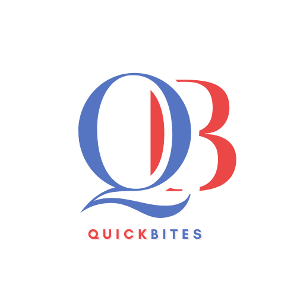
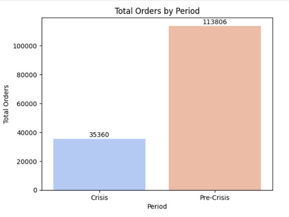
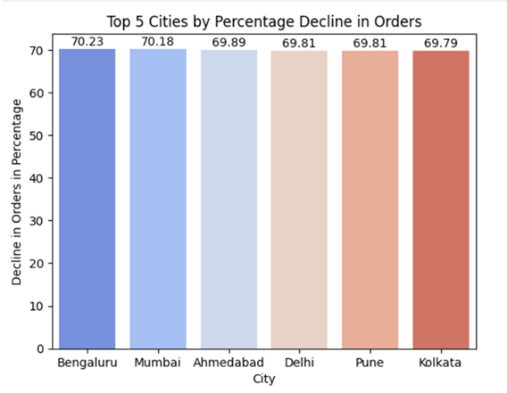
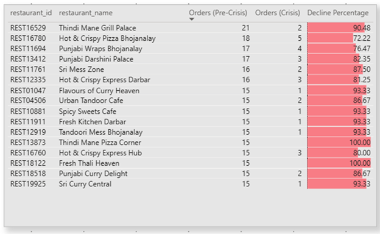
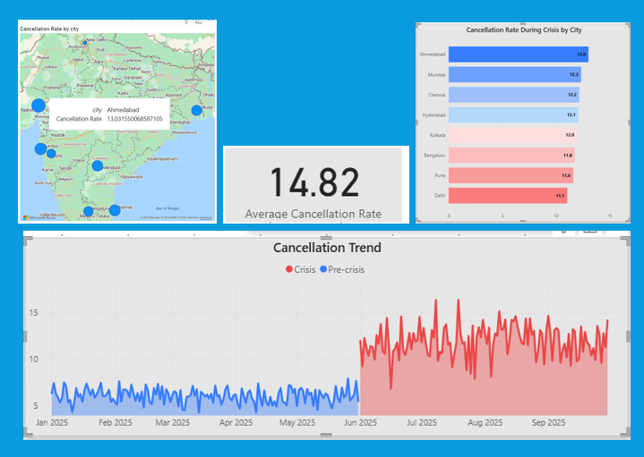
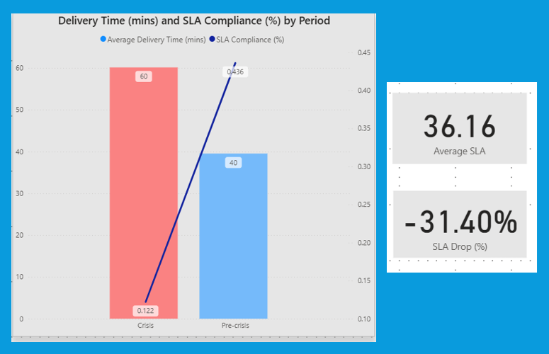
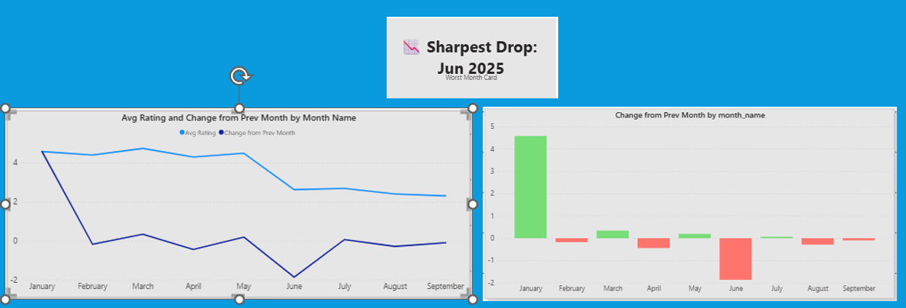
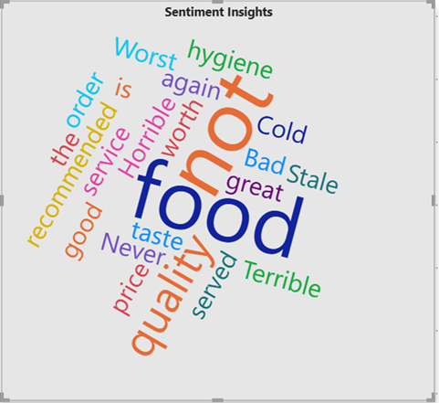
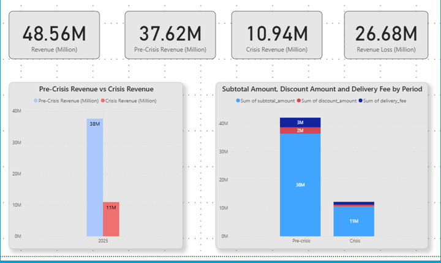

# QuickBite Crisis Analysis & Recovery Strategy

### 🧩 Domain: Food Delivery & Consumer Analytics
### 💼 Function: Crisis Recovery & Business Strategy  
### 🛠 Tools: SQL, Python, Power BI, GitHub

**Live Dashboard:** [Click here](https://app.powerbi.com/view?r=eyJrIjoiZmYzY2NmNWItMmM1NC00M2ZiLTk2ZWUtNGJlM2M1NjEyOTYxIiwidCI6ImM2ZTU0OWIzLTVmNDUtNDAzMi1hYWU5LWQ0MjQ0ZGM1YjJjNCJ9)

---

## 📌 Table of Contents
- <a href="#overview">Project Overview</a>
- <a href="#business-problem">Business Problem</a>
- <a href="#dataset">Dataset</a>
- <a href="#tools--technologies">Tools & Technologies</a>
- <a href="#data-model">Data Model</a>
- <a href="#parimary-analysis">Primary Analysis</a>
- <a href="#dashboard">Dashboard</a>
- <a href="#key-learnings">Key Learnings</a>
- <a href="#author--contact">Author & Contact</a>

---

<h2>Overview</h2>
This project analyzes QuickBite’s operational crisis using SQL, Python and Power BI dashboards to detect performance bottlenecks, customer churn trends, and revenue impact. It concludes with a data-backed recovery strategy to restore business performance and optimize decision-making.

---

<h2>Business Problem</h2>
QuickBite Express is a Bengaluru-based food-tech startup (founded in 2020) that connects customers with nearby restaurants and cloud kitchens.In June 2025, QuickBite faced a major crisis. A viral social media incident involving food safety violations at partner restaurants, combined with a week-long delivery outage during the monsoon season, triggered massive customer backlash. Competitors capitalized with aggressive campaigns, worsening the situation.
This project, part of the **Codebasics Resume Project Challenge**, focuses on building an **interactive dashboard** that answers key stakeholder questions across:  
- Finance  
- Sales  
- Marketing  
- Supply Chain  
- Customer 
- Executive 

---

<h2>Dataset</h2>
The project uses eight datasets provided for the Resume Project Challenge #18. 
They cover customers, delivery_partner, menu_item, restaurant, delivery_performance, order_items, orders and ratings.

---

<h2>Tools & Technologies</h2>

- Power BI
- SQL
- Python   
- GitHub

---

<h2><a class="anchor" id="data-model">Data Model</a></h2>

A well-structured Star schema for efficient querying and optimized performance.  

---

## Primary Analysis

### Key Questions
1. Monthly Orders: Compare total orders across pre-crisis (Jan–May 2025) vs crisis (Jun–Sep 2025). How severe is the decline? 

### Data Visualization

*Figure 1: Monthly Orders : Crisis vs Pre-Crisis*

### Key Insights/ Findings
- During the crisis period (Jun–Sep 2025), total orders **declined by 69%**, dropping from **113,806 (pre-crisis)** to **35,360**. The downturn coincided with a **social media backlash over food safety violations** at partner restaurants and a **week-long delivery outage during the monsoon season**.

### Key Questions
2. Which top 5 city groups experienced the highest percentage decline in orders during the crisis period compared to the pre-crisis period? 

### Data Visualization

*Figure 2: Top 5 Cities With Highest Decline*

### Key Insights/ Findings
- **Impact Across Cities:** Decline is **uniform (~70%)**, showing the crisis affected **brand perception nationwide**, not just regionally.
- Slightly higher drops in Tier-1 cities (Bengaluru, Mumbai) indicate **urban customers are more sensitive to safety and reliability issues**.

### Key Questions
3. Among restaurants with at least 50 pre-crisis orders, which top 10 high-volume restaurants experienced the largest percentage decline in order counts during the crisis period? 

### Data Visualization

*Figure 3: Top Restaurants With Highest Decline*

### Key Insights/ Findings
- **Thindi Mane Pizza Corner** saw a complete halt (100% decline) in orders.
- **Spicy Sweets Cafe** (−93.33%) and **Thindi Mane Grill Palace** (−90.48%) also experienced near-total shutdowns.
- Even popular multi-brand outlets like **Hot & Crispy** and **Punjabi** chains saw declines above 70–80%, indicating that the crisis impacted well-established, high-volume restaurants as much as smaller ones.
- This pattern suggests that the crisis caused a sharp behavioral shift — either due to supply-side disruptions (restaurant closures, delivery limitations) or demand-side changes (customers avoiding certain cuisines, dine-out categories, or price points).

### Key Questions
4. Cancellation Analysis: What is the cancellation rate trend pre-crisis vs crisis, and which cities are most affected? 

### Data Visualization

*Figure 4: Cancellation Analysis*

### Key Insights/ Findings
- **Most affected cities by cancellation rate increase**: Ahmedabad: +6.95%, Mumbai: +6.48%, Chennai: +6.12%, Kolkata: +6.11%, Hyderabad: +5.99%.
- The increase in cancellations (~6–7%) indicates that **customer trust and order fulfillment  were heavily impacted** in these metro cities.
- Cities with **higher order volumes and social media penetration** (e.g., Ahmedabad, Mumbai) were more sensitive to reputational and operational issues.
- The combination of a **food safety scandal** and **delivery disruptions** amplified cancellations, reflecting both **brand perception risk and logistics failure**.

### Key Questions
5. Delivery SLA: Measure average delivery time across phases. Did SLA compliance worsen significantly in the crisis period? 

### Data Visualization

*Figure 5: Delivery SLA*

### Key Insights/ Findings
- **Delivery times are longer**.The average delivery time of 44.4 minutes is significantly higher than pre-crisis levels, suggesting operational slow-downs.
- **Service reliability collapsed**.SLA compliance at 0.36 % means almost all deliveries were late relative to expectations.
- **Performance deterioration is clear**.The negative SLA Drop % (−0.31 p.p.) confirms a measurable fall in on-time deliveries compared with the earlier period.

### Key Questions
6. Ratings Fluctuation: Track average customer rating month-by-month. Which months saw the sharpest drop? 

### Data Visualization

*Figure 6: Rating Fluctuation*

### Key Insights/ Findings
- June 2025 experienced a sharp decline in customer ratings due to a combination of operational failures (delivery outage) and reputation damage (food safety viral incident). April and August also showed negative fluctuations, possibly linked to other service or operational issues.

### Key Questions
7. Sentiment Insights: During the crisis period, identify the most frequently occurring negative keywords in customer review texts. (Hint: Use a Word Cloud visual in Power BI to visualize the findings.) 

### Data Visualization

*Figure 7: Sentiment Insights*

### Key Insights/ Findings
- Customer sentiment during the crisis was heavily negative, primarily due to food quality concerns and delivery failures, amplified by a viral social media incident. Words like **stale**, **cold**, and **terrible** dominate the feedback, highlighting urgent operational and reputational risks.”

### Key Questions
8. Revenue Impact: Estimate revenue loss from pre-crisis vs crisis (based on subtotal, discount, and delivery fee).

### Data Visualization

*Figure 8: Revenue Impact*

### Key Insights/ Findings
- The largest revenue drop came from the **subtotal**, indicating fewer and/or smaller orders.
- Discount reductions contributed slightly, but the**major factor was operational and reputational issues**.
- Delivery fees also plummeted, pointing to **service interruptions during the crisis**.
- Overall, **the crisis period significantly impacted both order volume and revenue streams**.

---

<h2><a class="anchor" id="dashboard">Dashboard</a></h2>

1. **Home**  
   Project Landing Page for QuickBite Crisis Analysis & Recovery Strategy.
   - [Home](dashboard/Home.png)

2. **Executive Overview**  
   Monitor Orders by Average revenue trend, Monitor Decline Percentage based on city, cuisine and restaurant, Revenue Loss by City, Key Insights.
   - [Executive Overview Dashboard](dashboard/Executive_Overview.png)
   
## Key Findings
- Business snapshot : Total orders: 149K; Total revenue: 48.56M → AOV ≈ 325.9. Forecast: 164.08K orders and 49.06M revenue → forecasted AOV ≈ 299.0 (volume up, AOV down).

3. **Sales Performance Dashboard**  
   Gain insights about Orders Pre-Crisis and Crisis for Top 5 City, Revenue by Period Breakdown by City, Top 10 Restaurants by Revenue based on different periods, Impact of city and cuisine type.
   - [Sales Performance Dashboard](dashboard/Sales_Performance.png)

4. **Marketing & Sentiment Insight**  
   Monitor Average rating Trend, Monitor Decline Percentage based on city, cuisine and delivery status, Average rating by delivery delay, Montor Review Text.
   - [Marketing & Sentiment Insight](dashboard/Marketing_and_Sentiment.png)
   
5. **Supply Chain & SLA Performance**  
   Monitor Average SLA by City, Delivery Time and SLA Compliance by Different period,  Monitor Decline Percentage based on city, cuisine and restaurant, Monitor cancellation rate, SLA%, Month and Total Orders, by City and Cuisine Type.
   - [Supply Chain & SLA Performance](dashboard/Supply_Chain_and_SLA_Performance.png)
   
## Key Findings
- Operational performance : Avg delay 5.71 days (too high for on-time expectations). Avg SLA 36.16 (appears low — likely % of orders meeting SLA).
- Timing & root signal : June is the inflection month: orders ↓, cancellations ↑, sentiment score ↓ massively. Cancellation rate at 7.45% (material loss and operational cost).

   
6. **Customer Lifetime & Retention**  
   Customer Lifetime & Retention - Monitor Repeat Customer % by City by Month,  Monitor Key Influencer for Repeat Purchase, Customer Count by Stage, Monitor Loyalty Retention % for city and cuisine.
   - [Customer Lifetime & Retention](dashboard/Customer_Lifetime_and_Retention.png)
   
## Key Findings
- Customer voice : Reviews contain severe negative words: terrible, horrible, stale, bad, hygiene —  indicates quality/hygiene issues (product/service), not just late delivery.   
   
7. **Executive Insights Dashboard**  
   Monitor Review Text, Monitor Orders and Cancellation Rate Trend, Sentiment Score Trend, Recovery Impact Matrix. 
   - [Executive Insights Dashboard](dashboard/Executive_Insights_Dashboard.png)
---

<h2><a class="anchor" id="key-learnings">Key Learnings</a></h2>

- Use of Ai Visuals like Key Influencer, Decomposition Tree and Insight.
- Toggle between 2 different visuals using Bookmarks.
- Use of Heatmap.
- Used Gamma.ai for Project Presentation.

---

## Executive Summary
Revenue is roughly ₹48.56M on 149K orders (AOV ≈ ₹326), but orders dropped in June while cancellations rose to 7.45% and average sentiment plunged to 0.53 driven by review keywords like “terrible / horrible / stale / hygiene”. Forecast expects orders to recover to 164.08K but with a lower AOV (~₹299), so recovery in volume may not restore revenue unless AOV or churn is managed. SLA (36.16) and average delay (5.71 days) are major operational problems linked to customer dissatisfaction.

---

## Key Findings 
- Impact : Negative sentiment + cancellations likely cause revenue erosion beyond immediate refunds — reduces repeat purchases & increases CAC. Forecasted revenue growth is tiny (+0.5M) despite +10% volume because of falling AOV — risk of hollow recovery.

---

## Hypothesis (To Test Quickly)
- Quality/hygiene failures (warehouse / packaging / specific SKUs) started in June → 
raised returns & complaints.
- Delivery breakdown (specific regions / partners) increased delays, causing cancellations and
 negative reviews.
- Stocking / replenishment errors caused stale items to ship (supplier or fulfillment issue).
- Promotions / discounting shifted mix to lower-price items → forecast AOV drop.
- A spike in specific item(s) or vendor(s) causing concentrated negative reviews and cancellations.

---

## Priority recommendations (Immediate → Short → Medium)

### Immediate (0–72 hrs) — Contain damage
- Stop & isolate: pause orders from top 5 SKUs / vendors / warehouses that show highest negative-review density (filter by keywords + returns). Owner : Ops/ Merchandising
- Customer triage & goodwill: proactively identify customers from June with negative reviews / cancellations and send apologies + offer refunds/discount vouchers (prevent churn). Owner: CX & CRM (72h).
- Public messaging: short, transparent comms across app/email acknowledging issues and stating corrective steps — reduces escalation. Owner: Marketing + Legal.
- Operational quick check: send an urgent hygiene/quality inspection checklist to all fulfillment centers and top 3 delivery partners. Stop shipments if hygiene fails. Owner: Ops/Quality.
- Hold targeted promos that increase volume of at-risk SKUs until problem resolved.Owner: Growth/Marketing.

### Short term (1–14 days) — root-cause & quick fixes
- Drill-down analysis (48–72h): slice June vs May by region, SKU, vendor, DC, delivery partner, time-of-day to find concentration of negative signals. Prioritize top 3 hotspots. Deliverable: heatmap + ranked list of 3 root causes.Owner: Data & Ops.
- Temporary quality controls at pick/pack level: mandatory QC check + photo logs for perishable/fresh items.Owner: Ops/Quality.

### Medium term (1–3 months) — prevent recurrence & optimize
- Supplier / SKU remediation: renegotiate vendor SLAs, remove/replace repeated offenders, require batch testing for perishables.Owner: Merchandising/Procurement.
- SLA improvement program: set target to increase SLA from 36% → 75% in 3 months, track weekly.Owner: Ops.

### Recommended KPIs to track (dashboards & alerts)
- Daily monitoring (alerts): Cancellation rate (alert if >6.5%), Avg delay (alert if >4 days), Avg SLA (alert if <50%), Negative sentiment ratio (alert if >10% of reviews are negative)

---

## Report 
- [Final Report](report/QuickBite-Crisis-Analysis-and-Recovery-Strategy.pdf)

---

<h2>Author & Contact</h2>

**Rita Mahato**  
Aspiring Data Analyst  
📧 Email: ds.rita.mahato@gmail.com  
🔗 [LinkedIn](https://www.linkedin.com/in/mahato-rita/)  
